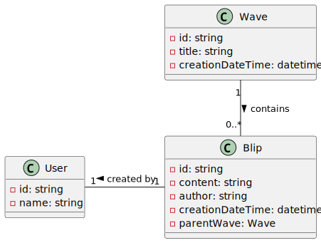
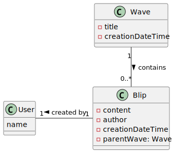

# Modelo del dominio

## Idea base

- Una "wave" era la unidad básica de conversación, similar a un hilo en un foro. Cada wave podía tener múltiples "blips" que eran contributions individuales.
- Los blips podían ser mensajes de texto, archivos, imágenes, etc. Cada blip tenía un autor y timestamp.
- Las waves permitían edición colaborativa en tiempo real, todos los participantes podían editar y ver los cambios simultáneamente blip por blip.
- Las waves podían tener relaciones padre-hijo, similares a hilos de discusión, donde una nueva wave surge de otra previa.
- Existía un servidor central donde se almacenaban todas las waves. Los clientes se conectaban en tiempo real para enviar/recibir updates.
- La información se replicaba en servidores para escalar. Los clientes se conectaban al servidor más cercano.
- Había APIs para acceder a la información de las waves desde aplicaciones externas.
- Los datos se almacenaban en BigTable, la base de datos distribuida de Google.
- El frontend utilizaba tecnologías como AJAX para actualizaciones en tiempo real.

## Primera versión

Interesa obtener un modelo del dominio general, con ciertos detalles y sobretodo atendiendo a la definición de modelo del dominio: esto es, sin entrar en detalles técnicos finales, pero sí describiendo adecuadamente la solución.

|||
|-|-|
|
